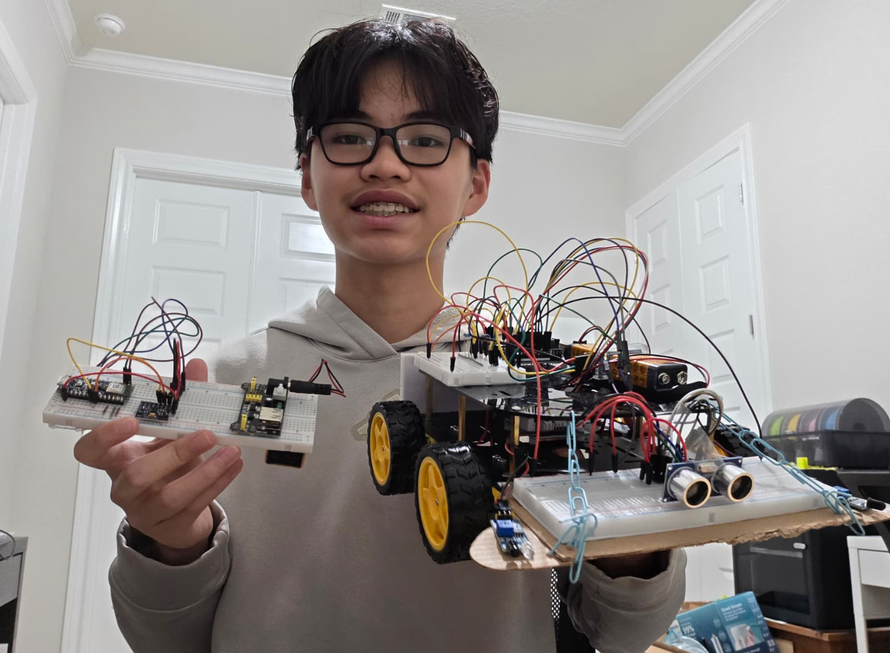
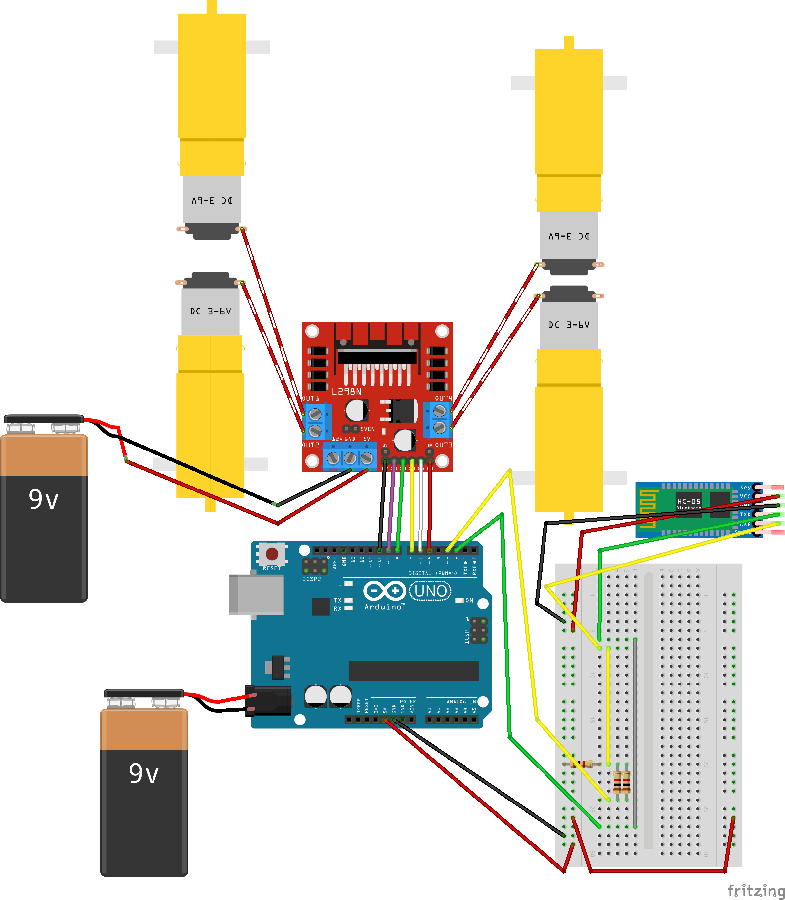
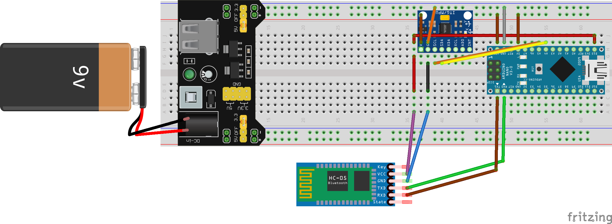
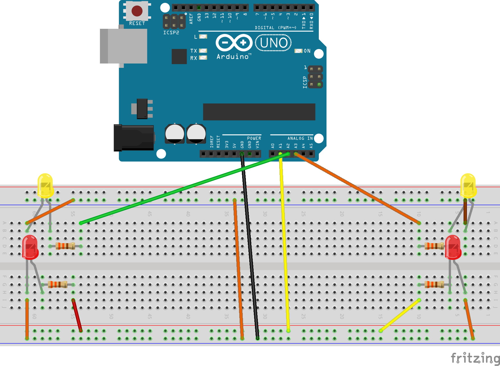
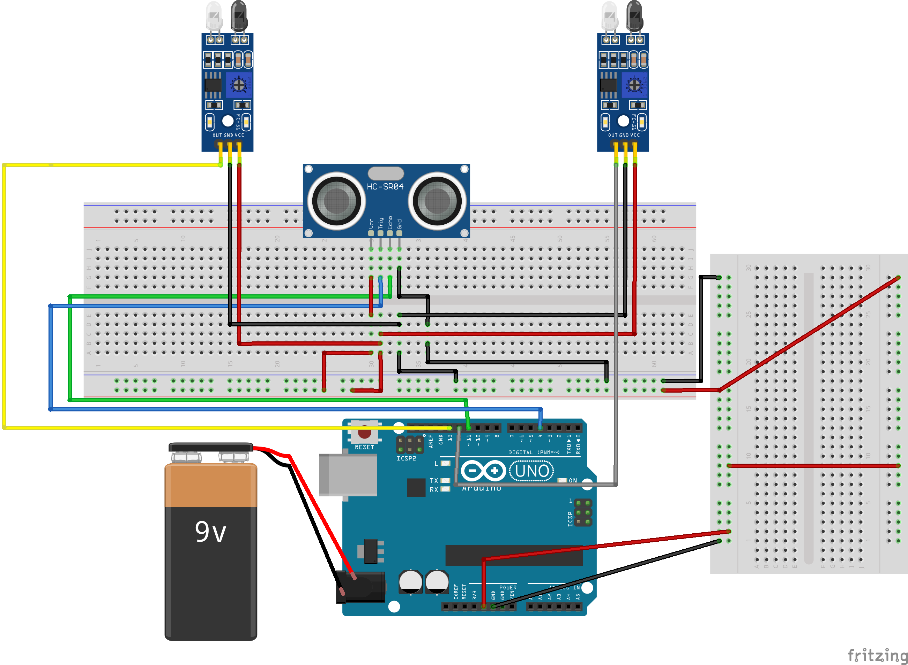

# Gestured Controlled Robot
My project, the Gesture Controlled Robot, is a robot that moves from the tilt of the controller. In addition to that, I've added 2 modifications. One is an obstacle avoidance module (doesn't let it crash), and rear lights (turn signals, brake lights).

| **Engineer** | **School** | **Area of Interest** | **Grade** |
|:--:|:--:|:--:|:--:|
| Jonathan T | McNeil High School | Mechanical Engineering | Incoming Sophomore


  
# Final Milestone

<iframe width="560" height="315" src="https://www.youtube.com/embed/EGdpX2PJOz0?si=yWJao6vWz5vQ0G73" title="YouTube video player" frameborder="0" allow="accelerometer; autoplay; clipboard-write; encrypted-media; gyroscope; picture-in-picture; web-share" referrerpolicy="strict-origin-when-cross-origin" allowfullscreen></iframe>

### Summary
For my final milestone, I worked on adding modifications. There are 2 modifications. I have an obstacle avoidance module and rear lights. The way these work is the obstacle avoidance module uses an ultrasonic sensor and 2 ir sensors. The ultrasonic sensor acts as the main sensor. It works by sending soundwaves and seeing how long it takes for the soundwaves to be received back. Then we have the ir sensors. These act as the emergency sensor in case the ultrasonic sensor fails. During this whole project, my biggest challenge has been connecting the HC-05 bluetooth modules. This is because there are various different things needed to be formatted in a certain order and messing one up can make the whole thing not work. However, I continued to work on it and eventually got it working. I have learned persistence and become familiar with circuits and Arduinos. In the future, I hope to learn to build my own robot from scratch (Making my own pieces). I hope to use the knowledge I have gained to implement this to robotics as a field and compete on my school's robotics team.

# Second Milestone

<iframe width="560" height="315" src="https://www.youtube.com/embed/-oUvwIYvIeA?si=aX1vO9CuitIUHga1&amp;start=1" title="YouTube video player" frameborder="0" allow="accelerometer; autoplay; clipboard-write; encrypted-media; gyroscope; picture-in-picture; web-share" referrerpolicy="strict-origin-when-cross-origin" allowfullscreen></iframe>

### Summary
In my second milestone, the main thing I have accomplished is getting my accelerometer wired in and connecting my HC05 Bluetooth Modules together. Both of these are important for different reasons. The accelerometer is important because it is what is detecting movement. This can be tilt, acceleration, or vibration. In this case, I am using tilt. When the accelerometer is tilted in any direction, is sends a signal to my robot. The way it sends this signal is because of the connected HC05 Bluetooth Modules. One thing in this project that surprised is how the debugging of the code seems complicated but is a lot easier then it looks. A challenge is faced in this milestone is getting the Bluetooth Modules to connect and communicate with each other. I had this problem because I had installed the wrong file onto my Arduino IDE. So all I had to do was install the correct file. Now, I need to make the Hand Module wireless, and add some modifications.

# First Milestone

<iframe width="560" height="315" src="https://www.youtube.com/embed/kWR7I4uDrG8?si=KUp_xfkqyDoa2PkN" title="YouTube video player" frameborder="0" allow="accelerometer; autoplay; clipboard-write; encrypted-media; gyroscope; picture-in-picture; web-share" referrerpolicy="strict-origin-when-cross-origin" allowfullscreen></iframe>

### Summary
The overall goal of my first milestone was to fully build the robot and make it operational. When I built the robot, I first attached the 4 motors to the chassis' frame. Then I connected all 4 motors to a motor driver and 1 wheel onto each of the motors. The motor driver was then connected to an Arduino Uno each powered by a 9 volt battery. Then I connected a HC05 to the Arduino Uno through a breadboard. As I continue to work on this project, this would allow me to connect the hand module with the robot itself. A challenge I faced was being able to supply a sufficient power source. When I was trying to power the motor driver, I noticed that I didn't have a way to connect the battery to the motor driver. Because of this, I had to receive a new tool. This allowed me to make a connection between the battery and the motor driver. Another challenge I faced was keeping my materials safe. When I was attaching the HC05 to the Arduino Uno through the breadboard, the wiring on my breadboard was incorrect. This resulted in my TX pin to go through the voltage divider rather then the RX pin which needed its voltage to be decreased. This ended up frying my RX pin and requiring me to get a new HC05 with a new RX pin. To complete my project, I plan to get the HC05s communicating to each other, get the accelerometer working, and connect all the pieces together so the robot can move along with he movement of the hand.

# Schematics 
### Robot Chassis


### Hand Module


### Rear Lights


### Obstacle Avoidance Module


# Code
### UNO CODE
```c++

#include <SoftwareSerial.h>

SoftwareSerial BT_Serial(2, 3);
// RX, TX
// ==========================
// L298N MOTOR DRIVER
// ==========================
#define enA 10
#define in1 9
#define in2 8
#define in3 7
#define in4 6
#define enB 5
// ==========================
// HC-SR04
// ==========================
#define TRIG 4
#define ECHO 11
// ==========================
// LIGHTS
// ==========================
#define BRAKE_LIGHT A1
#define LEFT_SIGNAL A2
#define RIGHT_SIGNAL A3
// 10 inches ≈ 26 cm
#define SAFE_DISTANCE 26
char command = 's';
int Speed = 180;
void setup() {
  Serial.begin(9600);
  BT_Serial.begin(38400);
  // Motor pins
  pinMode(enA, OUTPUT);
  pinMode(enB, OUTPUT);
  pinMode(in1, OUTPUT);
  pinMode(in2, OUTPUT);
  pinMode(in3, OUTPUT);
  pinMode(in4, OUTPUT);
  // Ultrasonic
  pinMode(TRIG, OUTPUT);
  pinMode(ECHO, INPUT);
  // Lights
  pinMode(BRAKE_LIGHT, OUTPUT);
  pinMode(LEFT_SIGNAL, OUTPUT);
  pinMode(RIGHT_SIGNAL, OUTPUT);
  stopMotor();
  updateLights('s');
  Serial.println("Robot Ready");
}
void loop() {
  // ==========================
  // BLUETOOTH INPUT
  // ==========================
  if(BT_Serial.available()) {
    char incoming = BT_Serial.read();
    if(incoming == 'f' ||
       incoming == 'b' ||
       incoming == 'l' ||
       incoming == 'r' ||
       incoming == 's') {
      command = incoming;
    }
    Serial.print("Command: ");
    Serial.println(command);
  }
  // ==========================
  // ULTRASONIC
  // ==========================
  int distance = getDistance();
  Serial.print("Distance: ");
  Serial.print(distance);
  Serial.println(" cm");
  // ==========================
  // OBSTACLE MODE
  // ONLY BACKWARD ALLOWED
  // ==========================
  if(distance <= SAFE_DISTANCE && distance > 0) {
    Serial.println("OBSTACLE - REVERSE ONLY");
    if(command == 'l') {
      turnLeft();
      updateLights('l');
    }
    else {
      stopMotor();
      updateLights('s');
    }
    setSpeed();
    delay(50);
    return;
  }
  // ==========================
  // NORMAL MODE
  // ==========================
  switch(command) {
    case 'f':
      forward();
      break;
    case 'b':
      backward();
      break;
    case 'l':
      turnLeft();
      break;
    case 'r':
      turnRight();
      break;
    default:
      stopMotor();
      break;
  }
  updateLights(command);
  setSpeed();
  delay(50);
}
// ==========================
// MOTOR FUNCTIONS
// ==========================
void forward() {
  digitalWrite(in1,HIGH);
  digitalWrite(in2,LOW);
  digitalWrite(in3,LOW);
  digitalWrite(in4,HIGH);
}
void backward() {
  digitalWrite(in1,LOW);
  digitalWrite(in2,HIGH);
  digitalWrite(in3,HIGH);
  digitalWrite(in4,LOW);
}
void turnLeft() {
  digitalWrite(in1,LOW);
  digitalWrite(in2,HIGH);
  digitalWrite(in3,LOW);
  digitalWrite(in4,HIGH);
}
void turnRight() {
  digitalWrite(in1,HIGH);
  digitalWrite(in2,LOW);
  digitalWrite(in3,HIGH);
  digitalWrite(in4,LOW);
}
void stopMotor() {
  digitalWrite(in1,LOW);
  digitalWrite(in2,LOW);
  digitalWrite(in3,LOW);
  digitalWrite(in4,LOW);
}
// ==========================
// LIGHT CONTROL
// ==========================
void updateLights(char movement) {
  digitalWrite(BRAKE_LIGHT, LOW);
  digitalWrite(LEFT_SIGNAL, LOW);
  digitalWrite(RIGHT_SIGNAL, LOW);
  if(movement == 'l') {
    digitalWrite(BRAKE_LIGHT, HIGH);
  }
  else if(movement == 'f') {
    digitalWrite(LEFT_SIGNAL, HIGH);
  }
  else if(movement == 'b') {
    digitalWrite(RIGHT_SIGNAL, HIGH);
  }
}
void setSpeed() {
  analogWrite(enA, Speed);
  analogWrite(enB, Speed);
}
// ==========================
// HC-SR04 DISTANCE
// ==========================
int getDistance() {
  digitalWrite(TRIG,LOW);
  delayMicroseconds(5);
  digitalWrite(TRIG,HIGH);
  delayMicroseconds(10);
  digitalWrite(TRIG,LOW);
  long duration = pulseIn(ECHO,HIGH,30000);
  if(duration == 0) {
    return 999;
  }
  return duration / 58;
}
```
### Nano Code
```c++

#include <Arduino_BMI270_BMM150.h>
float x, y, z;
char lastCommand = 's';
void setup() {
  Serial.begin(9600);
  // HC-05
  Serial1.begin(38400);
  if (!IMU.begin()) {
    Serial.println("IMU failed!");
    while(1);
  }
  Serial.println("Gesture Ready");
}
void loop() {
  if(IMU.accelerationAvailable()) {
    IMU.readAcceleration(x, y, z);
    char command = 's'
    // Tilt forward
    if(x < -0.6) {
      command = 'f';
    }
    // Tilt backward
    else if(x > 0.6) {
      command = 'b';
    }
    // Tilt left
    else if(y > 0.6) {
      command = 'l';
    }
    // Tilt right
    else if(y < -0.6) {
      command = 'r';
    }
    // Only send when command changes
    if(command != lastCommand) {
      Serial1.write(command);
      Serial.print("Sent: ");
      Serial.println(command);
      lastCommand = command;
    }
  }
  delay(100);
}
```
# Bill of Materials

| **Part** | **Note** | **Price** | **Link** |
|:--:|:--:|:--:|:--:|
| Car Chassis Kit | Main Frame of Robot | $39.99 | <a href="https://www.amazon.com/dp/B0DJ7BT1V5"> Link </a> |
| Screwdriver Kit | Tools Kit | $5.94 | <a href="https://www.amazon.com/Small-Screwdriver-Set-Mini-Magnetic/dp/B08RYXKJW9/"> Link </a> |
| Arduino Uno Clone | Reads Inputs and Controls Outputs | $14.98 | <a href="https://www.amazon.com/ELEGOO-Board-ATmega328P-ATMEGA16U2-Compliant/dp/B01EWOE0UU/ref=sr_1_2_sspa?crid=3A6NCD2X9JEMJ&dib=eyJ2IjoiMSJ9.AcWZy-Yg4mDTnhzEHozxzPZdVC5-KUL2tW-OQewDKpBB4brSpD-p4bn74WcXiW3KarYertgpNaLJ0VHKx0qsPqolKAhiz1GRG5BwJQl73cEvrlXIXNmqlpSvU7uu2aRVSwAZi9Gj2AjSPLM3esW1Gzy9xEiQ9oiR5LCNjh4MlYDx5mTm5sI4rsD4CFTipJnF572qXlickl35FRcCj8oMXQotumgqI4yEIq0HobOtIlEnNhtVB51JMBHhqtmmF_PC9WeHJ4ySUVVcv_gq3_VeG1aAEbdm4NXmmT6NOYPw4Qo.1PFdgFT22oqO5Mg6-6j_aUL_EV8tUPuaFrB5N9oaEX0&dib_tag=se&keywords=elegoo+arduino&qid=1716856465&s=electronics&sprefix=elegoo+arduino%2Celectronics%2C99&sr=1-2-spons&sp_csd=d2lkZ2V0TmFtZT1zcF9hdGY&psc=1"> Link </a> |
| Electronics Kit | Electronic Parts | $14.00 | <a href="https://www.amazon.com/Smraza-Electronics-Potentiometer-tie-Points-Breadboard/dp/B0B62RL725/ref=sxts_b2b_sx_reorder_acb_business?content-id=amzn1.sym.f63a3b0b-3a29-4a8e-8430-073528fe007f%3Aamzn1.sym.f63a3b0b-3a29-4a8e-8430-073528fe007f&crid=2IC3T44H3U3WG&cv_ct_cx=breadboard+kit&dib=eyJ2IjoiMSJ9.TUd5tu2T8rmms7ZuJ0UzmbtpLL1zsu93bQM0PzwnP4E.sT0V0vL_QtbYv8ymVTCcRkhFNgBtRvRiT7G4FT1oGTE&dib_tag=se&keywords=breadboard+kit&pd_rd_i=B0B62RL725&pd_rd_r=67e1f4ff-e3b9-44e4-b441-b4ae282f036b&pd_rd_w=UjFaP&pd_rd_wg=0xRoC&pf_rd_p=f63a3b0b-3a29-4a8e-8430-073528fe007f&pf_rd_r=BFGP77H27ZN31W4PZAW6&qid=1715911733&sbo=RZvfv%2F%2FHxDF%2BO5021pAnSA%3D%3D&sprefix=breadboard+kit%2Caps%2C109&sr=1-2-9f062ed5-8905-4cb9-ad7c-6ce62808241a"> Link </a> |
| Breadboard Kit | Breadboards to Connect Parts | $8.79 | <a href="https://www.amazon.com/Breadboards-Solderless-Breadboard-Distribution-Connecting/dp/B07DL13RZH/ref=sxts_b2b_sx_reorder_acb_business?content-id=amzn1.sym.f63a3b0b-3a29-4a8e-8430-073528fe007f%3Aamzn1.sym.f63a3b0b-3a29-4a8e-8430-073528fe007f&crid=1RAL6PA1TZ81Q&cv_ct_cx=breadboard+kit&dib=eyJ2IjoiMSJ9.TUd5tu2T8rmms7ZuJ0UzmbtpLL1zsu93bQM0PzwnP4E.sT0V0vL_QtbYv8ymVTCcRkhFNgBtRvRiT7G4FT1oGTE&dib_tag=se&keywords=breadboard+kit&pd_rd_i=B07DL13RZH&pd_rd_r=1e3e6f57-5578-4452-b230-90d43c79b5d3&pd_rd_w=rFN6B&pd_rd_wg=3mMuA&pf_rd_p=f63a3b0b-3a29-4a8e-8430-073528fe007f&pf_rd_r=JC9D7T4VYRDQ9HJVY5X8&qid=1715912837&s=electronics&sbo=RZvfv%2F%2FHxDF%2BO5021pAnSA%3D%3D&sprefix=breadboard+kit%2Celectronics%2C102&sr=1-1-9f062ed5-8905-4cb9-ad7c-6ce62808241a"> Link </a> |
| Arduino Nano 33 BLE Sense | Logic Control for Hand | $39.70 | <a href="https://www.amazon.com/Arduino-Nano-Sense-headers-ABX00070/dp/B0BQHZ88WD/ref=sr_1_4?crid=1BTYPUQCTIWYN&dib=eyJ2IjoiMSJ9.5ykyUyT10Vdnbme1Ur85NoPh9YmzeyxQKWTP0jF0ju7Zw9b2hLtWjY3pTyREGe5HkneZz75CgR3J9S8HJbMwmvkj1c1Mu9x0rZ651S1aBHwNqxIYbKjWG8yzYzDh5tcKP57E9RxRmqavQMCJ-QtCLIFas8oQKdBZDx67b_JUYJ3hdfDjHDXrimHAEzVTZrVAwh6NOXZ8-yMZIcp72LVtDsuQxyCvkrDyZM1EbuZQHlc.iy6QHwMR4-UrQZrInFc0eTSZJP6LewrRVqwpOfrQCG0&dib_tag=se&keywords=arduino+nano+33+ble&qid=1748096993&sprefix=arduino+nano+33ble%2Caps%2C151&sr=8-4"> Link </a> |
| Micro USB Cable | Upload Code | $5.00 | <a href="https://www.amazon.com/Charging-Transfer-Android-Trustable-MYFON/dp/B098DW7485/ref=sr_1_6?crid=3USJU0DMSZB2S&keywords=micro+usb&qid=1686187078&s=electronics&sprefix=micro+usb%2Celectronics%2C106&sr=1-6"> Link </a> |
| Accelerometer | Detects Acceleration | $9.00 | <a href="https://www.amazon.com/Arduino-A000066-ARDUINO-UNO-R3/dp/B008GRTSV6/(https://www.amazon.com/dp/B0D2TJVMNY?ref=fed_asin_title)"> Link </a> |
| HC05 | Connect Hand and Robot | $9.00 | <a href="https://www.amazon.com/DSD-TECH-HC-05-Pass-through-Communication/dp/B01G9KSAF6/ref=sr_1_3?crid=2J833J7AYQJA&keywords=hc05&qid=1686187263&sprefix=hc0%2Caps%2C112&sr=8-3"> Link </a> |
| Breadboard Power Supply | Lets Breadboard Connect to Battery | $8.00 | <a href="https://www.amazon.com/ALAMSCN-Solderless-Breadboard-Battery-Arduino/dp/B08JYPMCZY/ref=sxts_b2b_sx_reorder_acb_business?content-id=amzn1.sym.f63a3b0b-3a29-4a8e-8430-073528fe007f%3Aamzn1.sym.f63a3b0b-3a29-4a8e-8430-073528fe007f&crid=Z2S8NZU0KN1S&cv_ct_cx=breadboard+power+supply&dib=eyJ2IjoiMSJ9.nJ_euybTOUu9E6yyDpnEqg.NgztCYPGkG96eXyyFxpvxOVw5ykdTUq6oziUQnvf51E&dib_tag=se&keywords=breadboard+power+supply&pd_rd_i=B08JYPMCZY&pd_rd_r=f2beb6df-6d77-44a3-8b72-83255f19ca20&pd_rd_w=r1wmq&pd_rd_wg=ToFNq&pf_rd_p=f63a3b0b-3a29-4a8e-8430-073528fe007f&pf_rd_r=R5ZMMGW4CXRBP3PWAYMA&qid=1715912515&s=electronics&sbo=RZvfv%2F%2FHxDF%2BO5021pAnSA%3D%3D&sprefix=breadboard+power+s%2Celectronics%2C114&sr=1-1-9f062ed5-8905-4cb9-ad7c-6ce62808241a"> Link </a> |
| 9V Batteries | Power Components | $8.69 | <a href="https://www.amazon.com/Amazon-Basics-Performance-All-Purpose-Batteries/dp/B00MH4QM1S/ref=sr_1_5_pp?crid=3TQ7ANPH958JM&dib=eyJ2IjoiMSJ9.bmcV2Upj_vpB6G9CFlPPxYAryat512da7ekZjc52HecXSTmtx7PbJ50EgQFPCMqlAxjOUq-tL4vQTpozlHvH89bMwx-HJoyGcdz6EY8HrMxahTiqOXkoP7ewkDcgHoMhmHamdlQfW6FBHO0Gm-DYZZnnMuvEU3qOpemA8PGEvRhEx4-lGaBZhrvls039G1-9SizAW-YRGXZ2fFrdVDlREyyOhAuxXZaE5QqUxWesRQgP9UfGOYaInRWTTPwhDbXFa-RPzGbU1C_u4wq-NMqKBtWEQqR9-cA8O3FYOx3icEY.dtKJmI2T-iCmMM_bYnbiHUWzhKpJDRxS-bBmZIwYFKM&dib_tag=se&keywords=9v+batteries&qid=1720651326&rdc=1&s=electronics&sprefix=9v+batteries%2Celectronics%2C105&sr=1-5"> Link </a> |
| Velcro Tape | Connect Parts | $8.00 | <a href="https://www.amazon.com/Art3d-Sticky-Double-Sided-Command-Adhesive/dp/B0B58FGF8H/ref=sr_1_1_sspa?crid=2N0JOMEZLJ2DS&dib=eyJ2IjoiMSJ9.qGUGB_MXfmbL0MW7bqNJbxvZC9pzliDJ9KYyRNNrctnh03kCcUXONRrcPYdGeo7Jwzrm83HyF8Jsb1RkcdlLPAw-8RkxbTCMiW6UI1Fpnjv9GjXUg9VBOLxmLVUbmMp5J7gFXKKLTWQ-w_L4Q9rykEUqKmjv-v6GRykMMZLY2cVt__lLxMIlwr6qBnQLWpHiklifUJwjiURxO--TTt2VReYgmN0z7118ifSucrkvRrg.mwA0L4zMSlJP2RO8IBba7dVqwa1Lkr8KvY1JmeQEfCg&dib_tag=se&keywords=velcro+tape+pieces&qid=1716734034&sprefix=velcro+tape+piece%2Caps%2C89&sr=8-1-spons&sp_csd=d2lkZ2V0TmFtZT1zcF9hdGY&psc=1"> Link </a> |
| DMM | Debugging Tool | $9.99 | <a href="https://www.amazon.com/dp/B0CXM242J1?ref=fed_asin_title&th=1"> Link </a> |
| Ultrasonic Sensor | Calculates Distance | $5.25 | <a href="https://www.sparkfun.com/ultrasonic-distance-sensor-hc-sr04.html?srsltid=AfmBOopvCkdGgPeizHujfuCnxGNxFB0a5ZTZXOii6Ydir3w0fMY5s_pL2hE"> Link </a> |
| IR Obstacle Avoidance Module | Light Sensor | $5.75 | <a href="https://shillehtek.com/products/ir-infrared-obstacle-avoidance-sensor-module-for-arduino-robot?variant=51504782868767&country=US&currency=USD&utm_medium=product_sync&utm_source=google&utm_content=sag_organic&utm_campaign=sag_organic&srsltid=AfmBOoptnDFeTK4mK3JHRZr5QGDkJiLzgTyECOelhLMqFhiauJDTSrabx9Y&com_cvv=8fb3d522dc163aeadb66e08cd7450cbbdddc64c6cf2e8891f6d48747c6d56d2c"> Link </a> |
# Other Resources/Examples

1. <a href= "https://www.hackster.io/embeddedlab786/hand-gesture-control-robot-via-bluetooth-94b13d"></a>
2. <a href= "https://docs.google.com/document/d/1EpnEPulXQwPDSK-nKLohqPjpeXNteP2G/edit"></a>
3. <a href= "https://www.youtube.com/watch?v=BXXAcFOTnBo"></a>
4. <a href= "https://docs.sunfounder.com/projects/3in1-kit-v2/en/latest/car_project/car_auto.html"></a>
